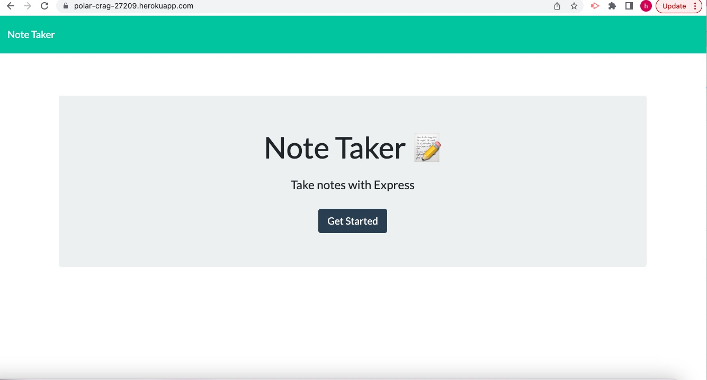

# Note Taker Application - Express.JS

This project is an application called Note Taker that let's users write and save notes on a note taking webpage. The user first comes to the landing page and then is taken to the notes.hmtl where you are presented with a title option for your note and where you can submit your notes and save the items to view later. 

## Screenshot

<a href= "https://polar-crag-27209.herokuapp.com/>" target="_blank">Link